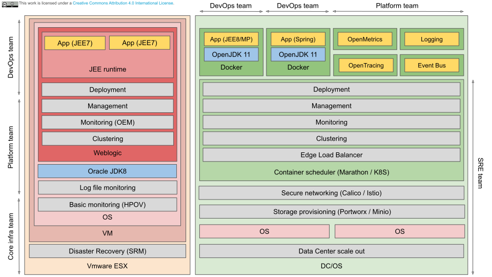

# About

Comparison between JEE application in Classic IT and private cloud from technology viewpoint.

# Technology architecture

[Source image](https://docs.google.com/presentation/d/1XKH50tbcgSswZFIBNtuN8qkmvSUdr5ooEhVdqnXcuQs/edit?usp=sharing)

# Notes

- JEE has been declared dead by Gartner. JEE app server features such as
  clustering are made obsolete by the container orchestrator. JakarataEE 8/MicroProfile
  enables JEE for the cloud. Build stateless disposable services according to
  [12factor.net](http://12factor.net) principles.
- Light-weight runtime with only JEE8/MP libraries needed. MicroProfile: Config,
  Health Check, Metrics, OpenAPI, JWT Propagation, Fault Tolerance, REST client. 
- Marathon/K8S: multiple deployment strategies for zero-downtime deployments. Elastic scaling
- DC/OS monitoring: single pane of glass for multiple clusters/clouds.
- CMDB: classic via agents for inventory scanning. Cloud:query against management APIs.
  Data integration problem instead of product selection? Beware of procurement of Eierlegende Wollmilchsau. 
- Observability in cloud: OpenMetrics for monitoring (Prometheus Stack),
  OpenTracing for tracing (Jaeger), EFD stack for logging. CloudEvents spec
  supports tracing of mixed sync/async flows. Constantly monitor and measure
  synthetic transactions. BPM is application function.
- Robust vs Anti-fragile: accept that outages do happen, make applications
  robust against it. Build self healing infrastructure. Use async events instead
  of sync messages. Focus on MTTR instead of MTBF and MTDB (Mean Time to Deflect
  Blame)
- CAP theorem, choose AP. No 2PC. Make applications eventually consistent.
  Patterns: Transactional Outbox, Saga, Aggregate, Event Sourcing. Needs Event Bus (Kafka)
  for implementing patterns and extendable architecture / Data Mesh. 
- Why not JMS?
  - Weblogic instead of container clustering, needs Oracle DB or NAS for persistence (both not cloud-native)
  - does not have self-healing shared-nothing architecture
  - API is standardized but on-the-wire format is proprietary and not compatible with other tech stacks
  - does not provide ordering of messages (desirable for receiving multiple versions of documents in order)
  - does not support replay for time travelling
  - does not support load-balancing (clients must know cluster IPs)
  - pushes to clients instead of pull (clients cannot be ephemeral and does not scale)
  - pub-sub not possible with ephemeral clients (subscribers to a topic must
    be registered before a message from a topic can be received).
- Note that in Classic IT, resposibilities between Core, Platform and DevOps teams are not aligned with technical boundaries.
  See [Vision on Platform Services in the Cloud](https://github.com/casparderksen/architecture/wiki/Vision-on-Platform-Services-in-the-Cloud).
